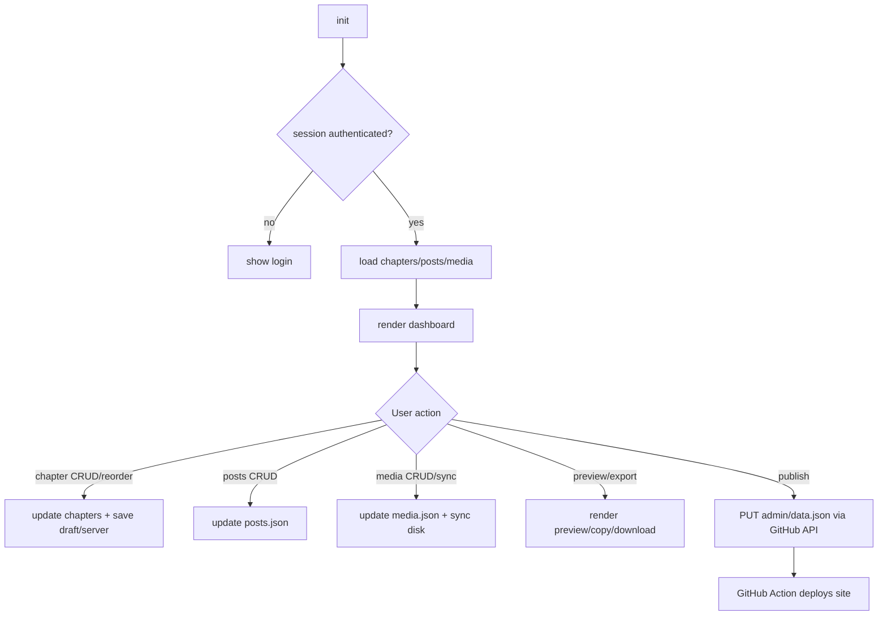
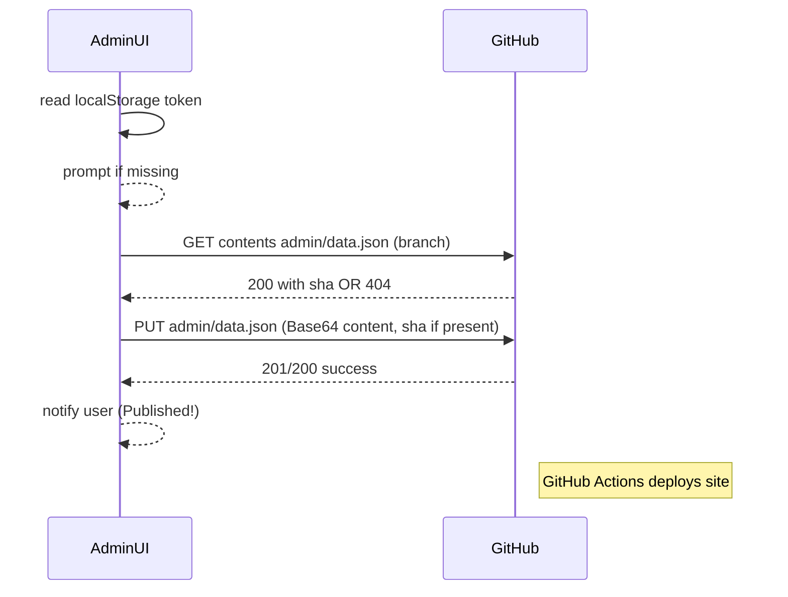

# Battle Bros Admin Overview

This document covers the admin panel (content editor) architecture, data flow, and major features. Current code is being modularized; `admin/app.js` remains the primary entry point, with shared constants in `admin/config.js` and DOM references in `admin/dom.js`.

## Entry Point and Shared Modules
- `admin/app.js` — Main script; handles auth, chapter CRUD, page reordering, blog posts, media library, preview/export, and GitHub publish.
- `admin/config.js` — Constants: passwords (temporary), storage keys, GitHub repo/branch/file info, API endpoints, filenames (`posts.json`, `media.json`).
- `admin/dom.js` — Centralized DOM lookups for forms, buttons, lists, modals, and status elements.

## Feature Areas
- Auth/session: Simple password gate (`ADMIN_PASSWORD`), session stored in `sessionStorage`.
- Chapter management: Load/save chapters; add/edit/delete; reconcile pages with disk via `/api/list-images`; reorder pages (drag/drop and up/down); renumber flow with confirmation.
- Page ops: Add/remove pages; ensure chapter folder creation via `/api/create-chapter`; delete images via `/api/delete-image`.
- Status message: Editable site-wide status stored with chapters.
- Blog/updates: CRUD for posts (`posts.json`), share flag, image + tags reuse, date formatting, preview text.
- Media library: Load/save `media.json`; search/filter by tags/path; sync with disk via `/api/list-media`; apply media to posts; tag propagation from posts.
- Preview/export: Chapter preview image navigation; JSON export/copy; share data assembly.
- GitHub publish: Uses personal access token from localStorage to PUT `admin/data.json` to the configured repo/branch; fetches SHA if file exists; warns/alerts on failures.
- UI: Modals for chapter edit, settings (token), renumber confirmation; indicators for unsaved changes; smooth scroll to sections.

## Data Paths and Persistence
- Reads: `admin/data.json` (chapters + folders + status), `posts.json`, `media.json`; image paths under `chapters/`.
- Writes (server): `/api/save` for `admin/data.json`, `posts.json`, `media.json`; `/api/create-chapter`, `/api/delete-image`, `/api/list-images`, `/api/list-media`.
- Local cache: `localStorage` (`STORAGE_KEY`) for draft chapters/status; `sessionStorage` (`SESSION_KEY`) for auth; GitHub token in `localStorage` (`GITHUB_TOKEN_KEY`).

## Runtime Flow (High Level)
1) `init` attaches handlers, upload handlers, checks session; shows login or dashboard.
2) Dashboard load: fetch chapters → render list; fetch posts → render; fetch media → sync with disk → render.
3) User actions: chapter CRUD/reorder, posts CRUD, media CRUD/sync, previews, exports, publish.
4) Persistence: localStorage draft save on chapter updates; server saves on explicit actions; GitHub publish on request.

## Visual Flow (Admin)


### Chapter Edit/Save Flow
```mermaid
flowchart LR
  X[Open edit modal] --> Y[reconcile pages with /api/list-images]
  Y --> Z[render page list (drag/drop + up/down)]
  Z --> W{rename chapter?}
  W -- yes --> M[remap folder mapping; delete old name]
  W -- no --> N[keep folder mapping]
  M --> O
  N --> O[ensure chapter folder via /api/create-chapter]
  O --> P[save chapters draft to localStorage]
  P --> Q[POST admin/data.json via /api/save]
  Q --> R[refresh chapter list + clear unsaved]
```

### GitHub Publish Sequence


## Near-Term Modularization Targets
- Split `admin/app.js` by concern: auth/session, chapters/pages, posts/blog, media library, preview/export, GitHub/publish, utilities.
- Centralize helpers (escape/tag parsing/sorting) into a small utilities module.
- Add happy-dom/Vitest coverage for core flows (chapter reorder/save, post save, media sync mapping, publish payload shape).
