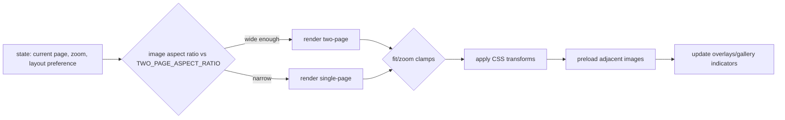

# Battle Bros Reader Overview

This document summarizes how the reader portion of the site is organized, what each module does, and the runtime flow. It excludes the admin panel.

## Entry Point and Data
- `reader/app.js` bootstraps config/state, fetches content, wires UI handlers, and kicks off rendering.
- Data sources: chapter images under `chapters/`, plus `media.json`, `posts.json`, and optionally `admin/data.json` for published chapter metadata.

## Modules
- `reader/config.js` — Tunables for layout/zoom, keyboard settings, debounce intervals; includes `TWO_PAGE_ASPECT_RATIO` (0.714).
- `reader/data.js` — Fetches chapters/media/posts, normalizes JSON, and provides simple caching helpers.
- `reader/chapters.js` — Chapter navigation helpers (next/prev resolution, slug/name mapping, index clamping).
- `reader/state.js` — Central mutable state (chapter, page, zoom, layout, overlays). Persists progress via `localStorage` and is resilient to storage errors.
- `reader/dom.js` — Cached DOM lookups and small helper methods to avoid repeated queries.
- `reader/render.js` — Draws the current page(s) (single/two-page), handles preloading, sizing logic, skeleton/empty states.
- `reader/controls.js` — Wires buttons/keyboard/toolbar actions to state updates and rendering; debounced scroll/page navigation.
- `reader/transform.js` — Zoom/pan math and clamping; applies CSS transforms to the image container.
- `reader/pointer.js` — Pointer/touch gestures (drag-to-pan, pinch-to-zoom) hooked into `transform`.
- `reader/fullscreen.js` — Toggles fullscreen mode and syncs UI indicators.
- `reader/overlays.js` — Manages overlays/modals (help, share, status); open/close and body scroll locking.
- `reader/gallery.js` — Thumbnail gallery rendering and selection; stays in sync with the current page.
- `reader/latest.js` — “Latest update” banner logic using posts/media to surface the newest item.
- `reader/email.js` — Builds share/email link data from the current page/chapter.

## Runtime Flow
1) `app.js` init: load config/state → fetch chapters/media/posts → render initial page(s).
2) Controls: UI/keyboard/gesture handlers update `state` → `render` redraws → `gallery`/overlays sync to the new state.
3) Persistence: `state.saveProgress` writes chapter/page to `localStorage`; errors are caught so reading is not blocked.
4) Layout: `render` chooses single vs two-page mode based on the aspect ratio threshold (`TWO_PAGE_ASPECT_RATIO`) and fit/zoom rules; uses preloading to reduce flicker.

## Visual Flow (Reader)
```mermaid
flowchart TD
  A[app.js init] --> B[load config/state]
  B --> C[fetch chapters/media/posts]
  C --> D[render initial page(s)]
  D --> E[attach controls/pointer/overlays/fullscreen/gallery]
  E --> F[User input (click/keys/gesture)]
  F --> G[controls updates state]
  G --> H[render redraws]
  H --> I[gallery + overlays sync]
  G --> J[saveProgress → localStorage (best effort)]
  H --> K[preload next/prev images]
```

### Render Decision Flow


## Testing
- Test suite: Vitest (36 tests) with happy-dom, covering navigation math, state persistence/error handling, and render layout selection.
- Files: `tests/chapters.test.js`, `tests/state.test.js`, `tests/render.test.js`; config in `vitest.config.js` and `tests/setup.js`.
